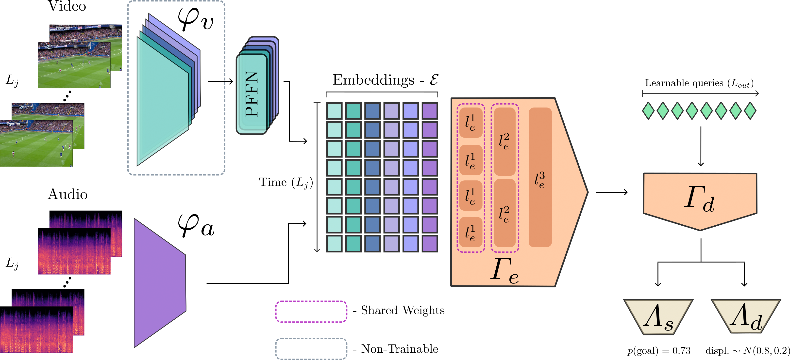

# ASTRA - [3rd place solution for SoccerNet Action Spotting Challenge 2023](https://github.com/SoccerNet/sn-spotting)

### [ASTRA: An Action Spotting TRAnsformer for Soccer Videos (ACM MMSports'23)](https://arturxe2.github.io/projects/ASTRA)
<a href="https://pytorch.org/get-started/locally/"></a>
[](https://arxiv.org/abs/2404.01891)
[](https://arturxe2.github.io/projects/ASTRA/)



This repository contains the PyTorch implementation of the paper:

**ASTRA: An Action Spotting TRAnsformer for Soccer Videos**<br>
*Artur Xarles, Sergio Escalera, Thomas B. Moeslund, and Albert Clapés*<br>
**ACM MMSports'23**<br>

### 1. Environment


<summary>Python/conda environment</summary>
<p>

```
conda create -n astra python=3.8.10
conda activate astra
pip install -r requirements.txt
```
### 2. Data

#### [**> SoccerNet-v2**](https://www.soccer-net.org/data)

Our model is built to tackle the task of Action Spotting in the SoccerNet-v2 dataset. To do so, it relies in both video and audio sources of information. We leverage visual data by utilizing Baidu features extracted from their [github repository](https://github.com/baidu-research/vidpress-sports). For the audio, we extract the log-mel spectrogram from the original videos (ask for the audio mel-spectrogram writing to arturxe@gmail.com). It's important to note that the code provided in this repository presupposes the prior extraction and storage of Baidu features and audio spectrograms in alignment with the standard SoccerNet structure:

```
data-folder
└───competition
    └───year
        └───match
            │   1_baidu_soccer_embeddings.npy
            │   2_baidu_soccer_embeddings.npy   
            │   audio1.npy
            │   audio2.npy
```

### 3. Execution

The files `main.py` and `main_challenge.py` are designed to train and evaluate ASTRA using the SoccerNet dataset. The first one  is thought to train the model on the train split, using early stopping via the validation split, and then evaluates on the test split. The second one is thought for the challenge evaluation, using as much data as possible (train, validation, and test) to generate predictions for the challenge split. Before you run them, make sure to update the configuration file according to your needs. In this file, you'll specify things like data folder and storage folder names, model parameters, and other settings:

```
configs
|   ASTRA.yaml
|   ASTRA_challenge.yaml
```

The main files can be exectued using:

```
python main.py --model_name ASTRA
python main_challenge.py --model_name ASTRA_challenge
```

## Citation


If you find our work useful in your research, please consider citing our paper:
```
@inproceedings{xarles2023astra,
  title={ASTRA: An Action Spotting TRAnsformer for Soccer Videos},
  author={Xarles, Artur and Escalera, Sergio, and Moeslund, Thombas B, and Clapés, Albert},
  booktitle={Proceedings of the 6th International Workshop on Multimedia Content Analysis in Sports},
  year={2023}
}
```

**Note:** project structure has been partially borrowed from original SoccerNet Action Spotting [starter pack](https://github.com/SoccerNet/sn-spotting/tree/main).
